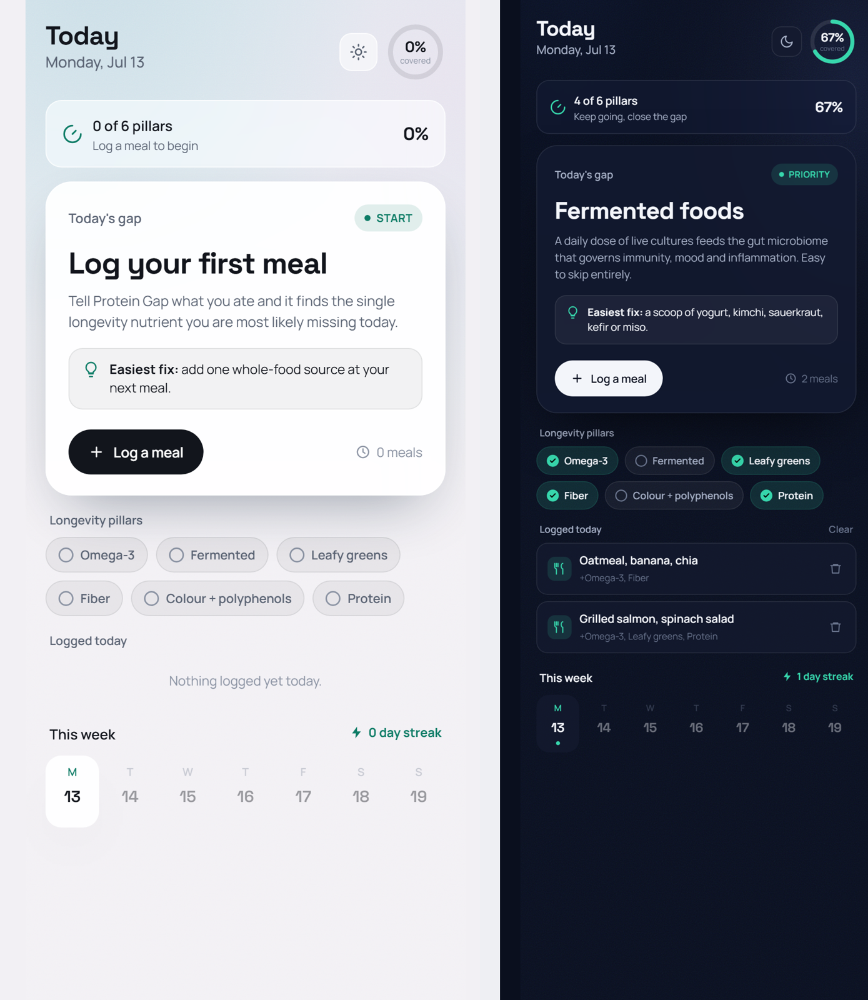

# Protein Gap

**Log a meal, get the ONE longevity nutrient you're most likely missing today.**

A tiny, single-file web app. No build step, no backend, no account - your log lives in `localStorage` on your device. Set your metrics once and Protein Gap calculates your personal daily targets. Then log meals in plain English ("salmon, spinach, brown rice") across Breakfast / Lunch / Dinner and it surfaces the single target you're furthest from hitting, with the easiest fix.



## Why

Most diet apps make you weigh food and count calories. You don't need that to live longer - you need to reliably hit a handful of nutrient pillars every day. Protein Gap tracks coverage, not calories, and only ever tells you the *next* thing to fix.

## The six pillars

Prioritised by how commonly people miss them:

1. **Omega-3 (EPA/DHA)** - oily fish, chia, flax, walnuts
2. **Fermented foods** - yogurt, kimchi, kefir, miso
3. **Leafy greens** - spinach, kale, rocket
4. **Fiber** - beans, lentils, oats, whole fruit
5. **Colour + polyphenols** - berries, peppers, cocoa, matcha
6. **Protein** - eggs, fish, tofu, greek yogurt

The nutrient model is a transparent keyword map (Layne Norton / Huberman / Blueprint flavoured), all in `index.html` - edit it to taste.

## Personalized targets

Enter your sex, age, weight, height, activity level and goal (metric or imperial). Protein Gap computes a daily target for each pillar so the numbers match your body, not an average:

- **Protein** - g/kg bodyweight, adjusted up for a cut or lean bulk
- **Fiber** - 14g per 1,000 kcal, off your Mifflin-St Jeor TDEE
- **Omega-3** - baseline EPA/DHA target, higher if you train hard
- **Greens / colour / fermented** - daily serving targets

## Features

- Personal daily targets auto-calculated from your metrics
- Breakfast / Lunch / Dinner meal slots, plus add-a-meal for snacks
- Plain-English logging with instant per-item nutrient estimates
- Each pillar shows `current / target` with a progress bar
- Coverage ring + "today's gap" focus card that always names your next fix
- This-week strip with a logging streak
- Animated logo splash that blurs into the app
- Light + dark themes (auto / light / dark toggle)
- 100% offline, one HTML file, zero dependencies

## Run it

Open `index.html` in a browser. That's it.

Or serve it:

```bash
python -m http.server 8000
# then open http://localhost:8000
```

## Deploy (GitHub Pages)

Settings -> Pages -> deploy from `main` / root. Done.

## Stack

Vanilla HTML/CSS/JS. Space Grotesk + Manrope. SVG progress ring. CSS `backdrop-filter` glass. No frameworks.

## License

MIT
